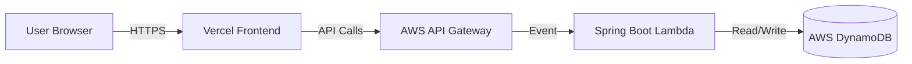

# 📈 Trading Strategy Backtester

**[🚀 Live Demo: https://trade-pulse-ivory.vercel.app/](https://trade-pulse-ivory.vercel.app/)**

---

## 📖 Project Overview

The **Trading Strategy Backtester** is a full-stack serverless application designed to simulate and analyze the performance of trading strategies against historical or synthetic market data. It allows quantitative traders (and enthusiasts) to validate their hypotheses before risking capital.

Currently, the system demonstrates a **Mean Reversion** strategy simulation on procedurally generated price data.

## 🏗️ System Architecture

The application checks the "Serverless" box by leveraging AWS managed services for scalability and zero-maintenance compute.



### High-Level Design
1.  **Frontend**: A responsive Single Page Application (SPA) that handles user configuration, visualizes equity curves with interactive charts, and displays historical performance metrics.
2.  **Backend API**: A Spring Boot application adapted for AWS Lambda (using `aws-serverless-java-container`). It exposes REST endpoints to trigger backtests and query history.
3.  **Simulation Engine**: The core business logic that processes price arrays, executes strategy rules (Buy/Sell/Hold), and calculates financial metrics (Win Rate, Drawdown, Profit).
4.  **Persistence Layer**: Results are stored in DynamoDB for low-latency retrieval of past simulations.

## 🛠️ Tech Stack

### Frontend
-   **Framework**: React 19 (via Vite)
-   **Language**: TypeScript
-   **Styling**: Modern CSS3 (Vanilla)
-   **Visualization**: Recharts (for equity curve plotting)
-   **Hosting**: Vercel

### Backend
-   **Framework**: Spring Boot 3.2.5
-   **Language**: Java 21
-   **Compute**: AWS Lambda (SnapStart enabled for fast cold starts)
-   **API Management**: AWS API Gateway (HTTP API)
-   **IaC**: AWS SAM (Serverless Application Model)

### Data
-   **Database**: Amazon DynamoDB
-   **Data Model**: Single-table design storing Backtest IDs, financial metrics, and timestamps.

## 🧩 Key Components

### 1. Strategy Engine (`MeanReversionStrategy.java`)
The current implementation uses a threshold-based Mean Reversion logic:
-   **Signal Generation**: Scans the price series window.
-   **Buy Rule**: Price drops > 5% (Expect a bounce back).
-   **Sell Rule**: Price rises > 5% (Expect a correction).
-   **Execution**: Simulates "All-in" trades (100% cash to asset, or 100% asset to cash).

### 2. Simulation Service (`BacktestingService.java`)
Orchestrates the backtest:
-   Accepts `Starting Balance` and `Price Data`.
-   Iterates through time, tracking cash vs. holdings.
-   Calculates "Mark-to-Market" value at every step.
-   Computes final Win Rate and Total Return.

## 🏁 Getting Started Locally

### Prerequisites
-   Java 21+
-   Node.js 18+
-   AWS CLI & SAM CLI (optional, for deployment)

### 1. Run the Frontend (Dev Mode)
The frontend uses synthetic data generation locally, so it works even without a live backend connection for testing UI flow.

```bash
cd frontend
npm install
npm run dev
```
Access at: `http://localhost:5173`

### 2. Run the Backend
You can run the Spring Boot app as a standard web server locally:

```bash
cd backend
./mvnw spring-boot:run
```
API Access: `http://localhost:8080`

> **Note**: To fully simulate the AWS environment locally, use `sam local start-api` if you have Docker installed.

## 📚 API Reference

| Method | Endpoint | Description |
| :--- | :--- | :--- |
| `POST` | `/prod/api/backtest` | Accepts `{startingBalance, prices[]}` and returns simulation results. |
| `GET` | `/prod/api/history` | Returns the last 10 simulation runs. |
